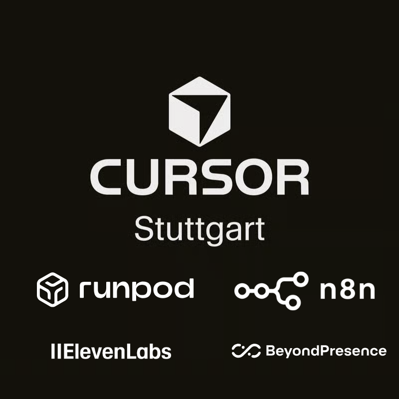
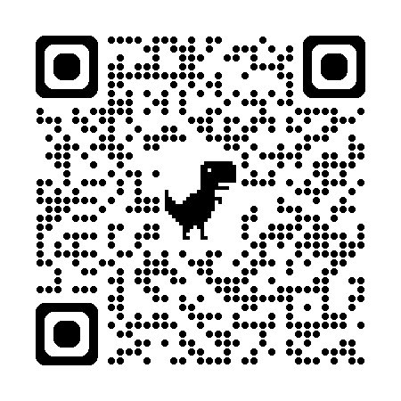
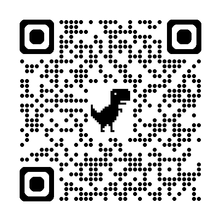

### Scan to Check In

**📶 WiFi:** CREATORS / **Password:** Creators

---

# Schedule - January 24, 2026

| Time | Event | Description |
|------|-------|-------------|
| **09:00** | Gates Open | Arrival & Registration |
| **09:30** | Kickoff | Welcome & Introduction |
| **10:00** | Hacking Begins | Start building! |
| **11:00** | Team Registration Deadline | Register your team on the portal |
| **12:30** | Lunch | Food break |
| **16:00** | First Round Judging | A judge visits each team for a quick pitch |
| **17:15** | Top 5 Demos | Finalists present to all judges and participants |
| **18:30** | Awards & Closing | Prize announcements |

---

# 📋 Hackathon Rules

- **Teams of 2-4 people** 👥
- **Build something new** 💡
- **Make sure your team is registered by 11:00 on the portal** ⏰
- **Highly encouraged to share a repo and video after the hackathon** 📹
- **Most importantly, have fun!** 🚀🚀🚀

---

# 🎁 Sponsors & Credits

<table class="sponsors-table">
<tr>
<td width="70%">

- **Cursor** ✨: AI-powered code editor. Check in to receive credits code.
- **ElevenLabs** 🎙️: AI voice technology. Join Discord for coupon code.
- **Runpod** 🚀: GPU cloud computing. Redeem $25 credits at credits.getrunpod.io
- **Beyond Presence** 🤖: AI agents. Join Discord for coupon code.
- **n8n** ⚡: Workflow automation. 1 month Cloud Pro.

</td>
<td width="30%" style="text-align: center;">

**Scan for details:**

</td>
</tr>
</table>

---

# 🚀 Runpod Demo

<a href="https://drive.google.com/file/d/1KNUuq3mcH2pzVCluhDlD4xevYNNwPT6_/view" target="_blank" style="display: inline-block; padding: 20px 60px; background: linear-gradient(135deg, #673ab7, #512da8); color: white; text-decoration: none; border-radius: 12px; font-size: 28px; font-weight: bold;">
▶️ Play Video
</a>

Click to open video in Google Drive

---

# 🤖 Beyond Presence Demo

<a href="https://www.youtube.com/watch?v=PIokTQBfZCQ" target="_blank" style="display: inline-block; padding: 20px 60px; background: linear-gradient(135deg, #ff0000, #cc0000); color: white; text-decoration: none; border-radius: 12px; font-size: 28px; font-weight: bold;">
▶️ Play Video
</a>

Click to open video in YouTube

---

# 🏆 Judging Criteria

Teams will be judged on a scale of 1-10 for each category:

1. **Technical Execution** 🛠️
   * How well-built is the project? Code quality, functionality, completeness.

2. **Creativity** 💡
   * Is the idea original and clever? Novel approach or use of technology.

3. **Presentation** 🎤
   * How well did they pitch it? Clear explanation, demo quality.

4. **Usefulness** 🤝
   * Does the team understand their user? Solving a real problem with practical impact.

---

# 🏅 Prizes (Total Value: $4,000+)

**🥇 1st Place**
Credits for Runpod, Cursor, n8n, ElevenLabs

**🥈 2nd Place**
Credits for Runpod, Cursor

**🥉 3rd Place**
Credits for Runpod, Cursor

**🎯 Special Category Awards**
ElevenLabs Scale subscription

 

---

# 🚀 Let's Get Hacking! 🚀

### Scan to Check In

**📶 WiFi:** CREATORS / **Password:** Creators

